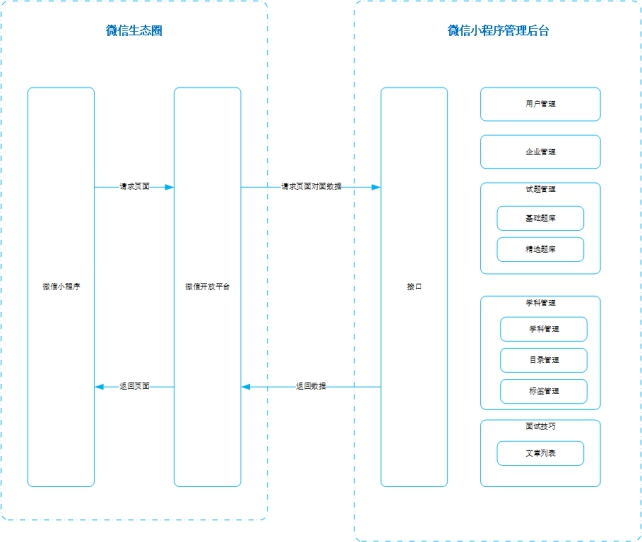

## 团队实战

### 01-项目描述

​	针对目前大量学员在培训完之后直接去面试企业的通过率低的问题，公司研发了黑马面面小程序，学员在空闲时间可以通过查看企业真实面试题，不仅可以查看企业真题，也可以通过刷题寻找自己的短板进行补充，新版本提供模拟面试功能，用户可以通过微信小程序进入模拟面试模块，完成定向企业面试和自由组题模式。




### 02-项目分析

主要是src目录分析：

```shell
├─api
│  ├─base     # 基础接口API
│  ├─example  # 例子
│  └─hmmm     # 功能接口API
├─assets      # 静态资源
├─components  # 组件
├─filters
├─icons
├─lang
├─mixins
├─mock
├─module-dashboard
├─module-details
├─module-form
├─module-hmmm   # 待完成的功能
│  ├─components # 组件
│  ├─pages      # 页面组件（包含8个页面） **重点**    
│  ├─router     # 模块路由
│  └─store      # 存储数据
├─module-list
├─module-manage
├─router        # 全局路由
├─store         # 存储数据
├─styles        # 样式
└─utils         # 工具
```


### 03-项目演示

- 原型文档：[http://czpm.itcast.cn/黑马面面/V2.0/](http://czpm.itcast.cn/%E9%BB%91%E9%A9%AC%E9%9D%A2%E9%9D%A2/V2.0/) 
- 接口文档：团队实战/hmmm-docs/03-接口文档/api.md
- 后台项目：团队实战/hmmm-backend
  - 修改 config/config.default.js  第63行  **连接数据库密码**
  - 在mysql创建数据库  mianmian   执行 db/mianmian.sql 文件
  - 启动 npm run dev    通过：http://localhost:7001 访问得到一段json代表成功
- 前端项目：团队实战/hmmm-frontend

  - 启动 npm run dev
  - 如果启动不成功，**卸载node-sass重新安装。**
  - npm un node-sass
    - npm i node-sass
  
  


### 04-分配任务

- 大家注册 <https://gitee.com/>  码云帐号
- 组长创建仓库，命名规则  hmmm-班级-组号 （hmmm-70-01）
- 上传本地仓库后，仓库地址发给大家。
- 在远程仓库添加仓库成员，就是小组成员，按用户名搜索即可，可批量。
- 小组成员克隆远仓库到本地（缺少包）
- 各自以自己的名字全拼创建本地分支
- 在自己的分支上开发各自分配的功能
  - 基础题库
  - 精选题库
  - 题库添加
  - 组题列表
  - 学科管理
  - 目录管理
  - 标签管理
  - 面试技巧
- 组长合并分支  

拉取远程分支并创建本地分支 <font color="red">项目完成时参考</font>


使用如下命令：

```
git fetch origin 远程分支名name:本地分支branch_x
```

使用该方式会在本地新建分支branch_x，但是不会自动切换到该本地分支branch_x，需要手动checkout。


### 05-问题答疑


